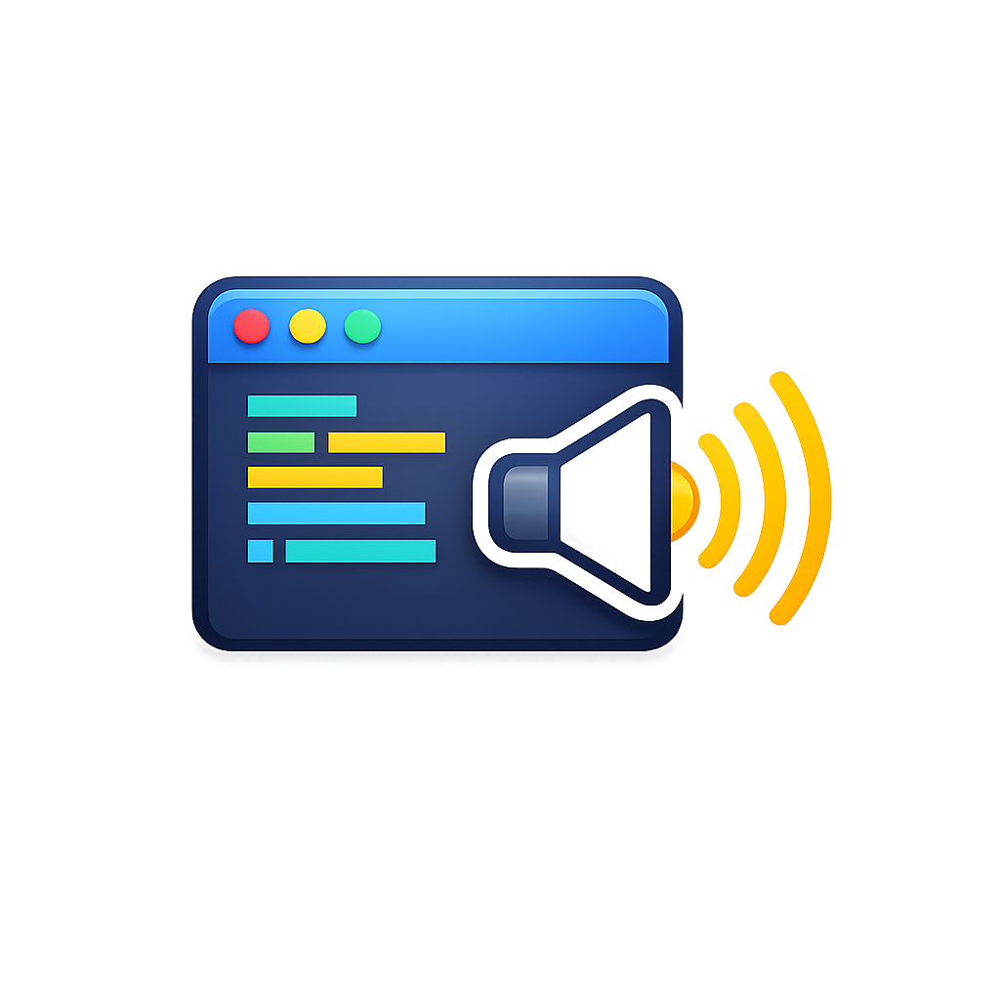

# FAH Failure Sound - IntelliJ Plugin

<p align="center">
  
</p>

<p align="center">
  <b>Mach Build-/Run-Ergebnisse hörbar</b> 🔊<br/>
  Meme-Sounds für Build, Run, Gradle, Maven und Terminal - inklusive Fehler, Erfolg und Warning.
</p>

<p align="center">
  
  
  
  
</p>

---

## ✨ Warum dieses Plugin?

Wenn du beim Entwickeln nicht ständig auf Build-/Run-Ausgaben schauen willst, spielt dieses Plugin passende Sounds bei IntelliJ-Events ab. So merkst du sofort, ob etwas schiefgelaufen ist - oder ob du feiern kannst. 🎉

## 🖼️ Preview

| Ansicht | Preview |
|---|---|
| Plugin Icon |  |
| Settings-Bereich | <br/>`Settings > Tools > FAH Failure Sound` |

## 🚀 Features auf einen Blick

- ✅ Sounds für Build, Run/Debug, Gradle, Maven und Terminal-Events
- ⚙️ Pro Event eigener Sound + eigene maximale Abspielzeit (`Max ms`)
- 🎚️ Lautstärke (`0-100`) und Debounce (`ms`) konfigurierbar
- 🧩 Eigene Audiodateien (`.mp3`, `.wav`) aus Custom-Ordner nutzbar
- 🔕 `No sound` pro Event möglich
- 🧪 Pro Event direkt testbar per `Test`-Button in den Settings

## 🎯 Trigger-Matrix

| Event | Wann wird getriggert? | Default |
|---|---|---|
| `Build failed` | IntelliJ Build mit Fehler | `Bundled / error.mp3` |
| `Build warning` | Build mit Warnings | `Bundled / error.mp3` |
| `Build succeeded` | Erfolgreicher Build | `Bundled / heavenly.mp3` |
| `Run failed` | Run/Debug mit `exitCode != 0` | `Bundled / error.mp3` |
| `Run succeeded` | Run/Debug mit `exitCode == 0` | `No sound` |
| `Gradle failed` | IntelliJ Gradle Runner meldet Fehler | `Bundled / error.mp3` |
| `Maven failed` | IntelliJ Maven Runner meldet Fehler | `Bundled / error.mp3` |
| `Terminal command failed` | Integriertes IntelliJ Terminal meldet Fehler | `Bundled / error.mp3` |
| `Terminal command succeeded` | Integriertes IntelliJ Terminal erfolgreich | `No sound` |

## ⚙️ Konfiguration

| Option | Beschreibung | Werte |
|---|---|---|
| `Enable sounds` | Plugin global ein-/ausschalten | `true/false` |
| `Volume` | Gesamtlautstärke | `0-100` |
| `Debounce (ms)` | Verhindert zu häufiges Triggern in kurzer Zeit | `0-60000` |
| `Show notification` | Zus. Balloon-Notification anzeigen | `true/false` |
| `Sound pro Event` | Quelle je Event wählen | `Bundled`, `Custom`, `No sound` |
| `Max ms (0=full)` | Max. Abspielzeit pro Event | `0-300000` |

### 📁 Custom Sounds

- Ordner: `<IDE config>/faah-sounds`
- Unterstützt: `.mp3`, `.wav`
- In Settings:
  1. `Open folder`
  2. Dateien reinlegen
  3. `Refresh sounds`
  4. Sound pro Event auswählen

## 🧱 Projektstruktur

```text
src/main/resources/META-INF/plugin.xml
src/main/resources/META-INF/pluginIcon.svg
src/main/resources/META-INF/pluginIcon_dark.svg
src/main/resources/icon.png
src/main/resources/error.mp3
src/main/resources/succeed.mp3
src/main/java/dev/eministar/fahsound
```

## 🛠️ Entwicklung & Build

### Lokale Sandbox starten (Windows PowerShell)

```powershell
.\gradlew.bat runIde
```

### Plugin ZIP bauen

```powershell
.\gradlew.bat buildPlugin
```

### Plugin in IntelliJ installieren

1. IntelliJ IDEA öffnen
2. `Settings > Plugins`
3. Zahnrad > `Install Plugin from Disk...`
4. ZIP aus `build/distributions/` wählen

## 🏪 Marketplace-Readiness

### Benötigte Umgebungsvariablen

| Variable | Zweck |
|---|---|
| `JB_CERTIFICATE_CHAIN` | Zertifikatskette für Signierung |
| `JB_PRIVATE_KEY` | Private Key |
| `JB_PRIVATE_KEY_PASSWORD` | Passwort zum Private Key |
| `JB_PUBLISH_TOKEN` | Token für Marketplace Upload |

### Tasks

```powershell
.\gradlew.bat signPlugin
.\gradlew.bat publishPlugin
```

## ⚠️ Grenzen / Hinweise

- Externe OS-Terminals außerhalb von IntelliJ werden nicht überwacht.
- Die Terminal-Erkennung hängt von IntelliJ-Terminal/Shell-Integration ab.
- Trigger beziehen sich auf IntelliJ-Events (nicht auf beliebige Prozesse außerhalb der IDE).

## 📄 Lizenz

Dieses Projekt steht unter der MIT-Lizenz. Siehe `LICENSE`.

---

<p align="center">
  Mit ❤️ gebaut von <b>Eministar</b> für mehr Feedback beim Coden.
</p>
